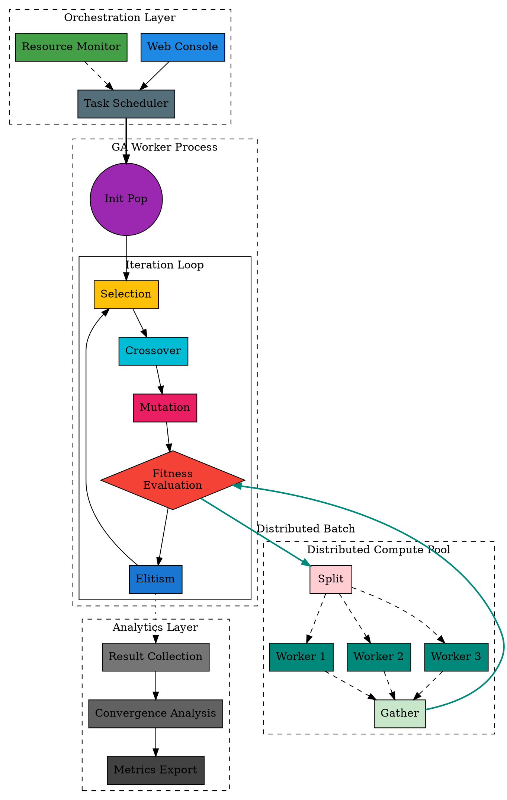

# GAPA 遗传算法分布式加速 Pipeline 描述文档 (专业版)

## 一、整体布局架构 (Compact Layout Architecture)

### 1.1 布局策略
采用 **"上-中-下" 三层紧凑布局** + **"左-右" 分布式扩展** 的设计，最大化空间利用率，减少空白区域：

```markdown:/Users/nakilea/Desktop/GAPA/pipeline.md
<code_block_to_apply_changes_from>
```
┌─────────────────────────────────────────────────────────────────────────┐
│  Layer 1: 控制与编排层 (Orchestration Layer) - 顶部横条，紧凑排列      │
│  [Web Console] → [Task Scheduler] ← [Resource Monitor]                 │
└─────────────────────────────────────────────────────────────────────────┘
                              │
                              ▼
┌─────────────────────────────────────────────────────────────────────────┐
│  Layer 2: 核心计算引擎 (Core Computation Engine) - 主体区域           │
│  ┌─────────────────────────────────────────────────────────────────┐ │
│  │  GA Worker Process Container (虚线框，浅橙色背景)                │ │
│  │  ┌───────────────────────────────────────────────────────────┐ │ │
│  │  │  Population Initialization (紫色圆形)                      │ │ │
│  │  │              │                                             │ │ │
│  │  │              ▼                                             │ │ │
│  │  │  ┌─────────────────────────────────────────────────────┐ │ │ │
│  │  │  │  Iteration Loop (紧凑圆形/矩形闭环)                   │ │ │ │
│  │  │  │  [Selection] → [Crossover] → [Mutation] → [Fitness] → │ │ │ │
│  │  │  │      ↑                                    [Elitism]   │ │ │ │
│  │  │  │      └──────────────────────────────────────────────┘ │ │ │ │
│  │  │  └─────────────────────────────────────────────────────┘ │ │ │
│  │  └───────────────────────────────────────────────────────────┘ │ │
│  └─────────────────────────────────────────────────────────────────┘ │
│                              │                                         │
│                              │ 分布式扩展 (右侧)                        │
│                              ├───────────────────────────────────────┐ │
│                              │  [Population Split]                  │ │
│                              │         │                            │ │
│                              │    ┌────┴────┐                       │ │
│                              │    │  │  │  │  (并行箭头)            │ │
│                              │  [W1][W2][W3][WN] Remote Workers     │ │
│                              │    │  │  │  │                        │ │
│                              │    └────┬────┘                       │ │
│                              │         │                            │ │
│                              │  [Result Gather]                     │ │
│                              └───────────────────────────────────────┘ │
└─────────────────────────────────────────────────────────────────────────┘
                              │
                              ▼
┌─────────────────────────────────────────────────────────────────────────┐
│  Layer 3: 结果分析层 (Analytics Layer) - 底部横条                      │
│  [Result Collection] → [Convergence Analysis] → [Metrics Export]      │
└─────────────────────────────────────────────────────────────────────────┘
```

### 1.2 空间分配比例
- **顶部控制层**: 高度 10% (紧凑横条)
- **中间计算层**: 高度 75% (主体区域，包含所有核心组件)
- **底部结果层**: 高度 10% (紧凑横条)
- **左右分布**: 左侧 60% (本地计算), 右侧 35% (分布式扩展), 留白 5%

## 二、详细组件定义与坐标 (Detailed Component Specifications)

### 2.1 Layer 1: 控制与编排层 (顶部，X: 0-100%, Y: 0-10%)

**布局**: 三个组件紧凑横排，无间隔

| 组件 | X坐标 | Y坐标 | 宽度 | 高度 | 颜色 | 图标 | 说明 |
|------|------|------|------|------|------|------|------|
| Web Console | 5% | 5% | 25% | 90% | #1E88E5 | 🖥️ | 用户界面，参数配置 |
| Task Scheduler | 35% | 5% | 35% | 90% | #546E7A | ⚙️ | 任务调度，Worker分配 |
| Resource Monitor | 75% | 5% | 20% | 90% | #43A047 | 📊 | 资源监控，节点评分 |

**连接线**:
- Web Console → Task Scheduler (实线，蓝色，加粗)
- Resource Monitor → Task Scheduler (虚线，绿色，细线)
- Task Scheduler → GA Worker (实线，黑色，加粗，向下)

### 2.2 Layer 2: 核心计算引擎 (中间，X: 0-100%, Y: 10-85%)

#### 2.2.1 GA Worker Process Container (外框容器)
- **位置**: X: 5%, Y: 15%, 宽度: 55%, 高度: 65%
- **样式**: 虚线边框 (2px, #FF9800), 浅橙色背景 (#FFF3E0, 透明度20%)
- **标注**: "GA Worker Process" (顶部居中)
- **功能**: 包含所有本地GA计算组件

#### 2.2.2 Population Initialization (种群初始化)
- **位置**: X: 15%, Y: 20%, 宽度: 12%, 高度: 8%
- **形状**: 圆形，紫色 (#9C27B0)
- **标注**: "Init Pop" (内部)
- **代码**: `gapa/framework/body.py:40-46`
- **输出**: 连接线向下指向迭代循环

#### 2.2.3 Iteration Loop (迭代循环 - 紧凑圆形布局)
**整体位置**: X: 10%, Y: 32%, 宽度: 45%, 高度: 40%

**循环内组件** (按顺时针排列，形成紧凑圆形):

| 组件 | 角度 | 相对中心偏移 | 尺寸 | 颜色 | 代码位置 |
|------|------|-------------|------|------|----------|
| Selection | 0° (右侧) | +20%, 0% | 10%×8% | #FFC107 | `body.py:48-59` |
| Crossover | 72° | +18%, +6% | 10%×8% | #00BCD4 | `body.py:67-70` |
| Mutation | 144° | +12%, +12% | 10%×8% | #E91E63 | `body.py:61-65` |
| Fitness Evaluation | 216° (左侧) | -20%, 0% | 14%×12% | #F44336 | `distributed_evaluator.py:258-317` |
| Elitism | 288° | -18%, -6% | 10%×8% | #1976D2 | `body.py:72-78` |

**循环连接**: 
- Selection → Crossover → Mutation → Fitness → Elitism → (回到) Selection
- 使用圆角箭头，形成闭环
- 线条样式: 实线，2px，蓝色 (#2196F3)

**Iteration Control (迭代控制)**:
- **位置**: 循环中心，X: 32.5%, Y: 52%
- **形状**: 小圆形，橙色 (#FF9800)
- **标注**: "Loop" (内部)
- **功能**: 控制迭代次数，记录状态

#### 2.2.4 分布式扩展区域 (右侧，X: 65-95%, Y: 15-80%)

**Population Split (种群分块)**:
- **位置**: X: 65%, Y: 45%, 宽度: 8%, 高度: 6%
- **形状**: 矩形，浅红色 (#FFCDD2)
- **标注**: "Split" (内部)
- **功能**: 根据节点权重分配种群块

**Remote Workers (远程Worker节点)**:
- **布局**: 垂直堆叠，紧凑排列
- **数量**: 3-4个节点 (根据max_workers配置)
- **每个节点位置**: 
  - Worker 1: X: 75%, Y: 30%, 宽度: 15%, 高度: 8%
  - Worker 2: X: 75%, Y: 42%, 宽度: 15%, 高度: 8%
  - Worker 3: X: 75%, Y: 54%, 宽度: 15%, 高度: 8%
  - Worker N: X: 75%, Y: 66%, 宽度: 15%, 高度: 8%
- **样式**: 服务器图标，绿色 (#00897B)，带边框
- **标注**: "Worker N" (每个节点)

**Result Gather (结果聚合)**:
- **位置**: X: 65%, Y: 78%, 宽度: 8%, 高度: 6%
- **形状**: 矩形，浅绿色 (#C8E6C9)
- **标注**: "Gather" (内部)
- **功能**: 合并所有远程节点的适应度结果

**分布式连接线**:
- Fitness Evaluation → Population Split (实线，绿色，加粗，2px)
- Population Split → [Worker 1, Worker 2, Worker 3, Worker N] (多条并行虚线，绿色，1px)
- [Worker 1, Worker 2, Worker 3, Worker N] → Result Gather (多条并行虚线，绿色，1px)
- Result Gather → Fitness Evaluation (实线，绿色，加粗，2px)

**标注**: 在连接线上标注 "Distributed Batch Evaluation" 和 "Fan-Out/Fan-In"

### 2.3 Layer 3: 结果分析层 (底部，X: 0-100%, Y: 85-100%)

| 组件 | X坐标 | Y坐标 | 宽度 | 高度 | 颜色 | 说明 |
|------|------|------|------|------|------|------|
| Result Collection | 10% | 88% | 25% | 10% | #757575 | 结果收集 |
| Convergence Analysis | 40% | 88% | 25% | 10% | #616161 | 收敛分析 |
| Metrics Export | 70% | 88% | 25% | 10% | #424242 | 指标导出 |

**连接线**:
- Iteration Control → Result Collection (点线，灰色，每代触发)
- Result Collection → Convergence Analysis → Metrics Export (实线，灰色)

## 三、技术细节标注 (Technical Annotations)

### 3.1 关键数据流标注

在关键连接线上添加标注：

1. **控制流** (Control Flow):
   - Web Console → Task Scheduler: "Task Request"
   - Task Scheduler → GA Worker: "Job Dispatch"
   - Resource Monitor → Task Scheduler: "Resource Score"

2. **数据流** (Data Flow):
   - Population Init → Iteration Loop: "Initial Population"
   - Selection → Crossover: "Selected Parents"
   - Crossover → Mutation: "Offspring"
   - Mutation → Fitness: "Candidate Solutions"
   - Fitness → Elitism: "Fitness Scores"
   - Elitism → Selection: "Next Generation"

3. **分布式流** (Distributed Flow):
   - Fitness → Split: "Population Tensor [N×B]"
   - Split → Workers: "Chunks [n₁×B], [n₂×B], ..., [nₖ×B]"
   - Workers → Gather: "Fitness Vectors [n₁], [n₂], ..., [nₖ]"
   - Gather → Fitness: "Aggregated Fitness [N]"

### 3.2 模式切换标注

在 Fitness Evaluation 组件上添加模式标注：

- **S模式**: 单GPU，本地计算
- **M模式**: 多GPU，torch.distributed
- **MNM模式**: 多机多节点，HTTP RPC

使用小标签在Fitness Evaluation组件右上角标注当前模式。

### 3.3 性能指标标注

在关键组件附近添加性能指标：

- **Fitness Evaluation**: 
  - "Latency: ~X ms/batch"
  - "Throughput: ~Y individuals/s"
  - "Communication: ~Z ms (MNM mode)"

- **Remote Workers**:
  - "Worker 1: Score=0.85, GPU=80%"
  - "Worker 2: Score=0.72, GPU=65%"
  - "Worker 3: Score=0.91, GPU=90%"

## 四、视觉增强元素 (Visual Enhancements)

### 4.1 颜色方案 (Color Scheme)

| 功能域 | 主色 | 辅助色 | 用途 |
|--------|------|--------|------|
| 控制层 | #1E88E5 (蓝) | #546E7A (灰蓝) | Web Console, Scheduler |
| 监控 | #43A047 (绿) | #66BB6A (浅绿) | Resource Monitor |
| 初始化 | #9C27B0 (紫) | #BA68C8 (浅紫) | Population Init |
| GA操作 | #FFC107 (黄) | #FFD54F (浅黄) | Selection, Crossover, Mutation |
| 适应度 | #F44336 (红) | #EF5350 (浅红) | Fitness Evaluation |
| 精英 | #1976D2 (深蓝) | #42A5F5 (浅蓝) | Elitism |
| 分布式 | #00897B (青绿) | #4DB6AC (浅青) | Remote Workers |
| 结果 | #757575 (灰) | #BDBDBD (浅灰) | Result Collection |

### 4.2 线条样式 (Line Styles)

| 类型 | 样式 | 宽度 | 颜色 | 用途 |
|------|------|------|------|------|
| 主控制流 | 实线 | 3px | #212121 | 主要流程 |
| 迭代循环 | 实线，圆角 | 2px | #2196F3 | GA循环 |
| 分布式流 | 虚线 | 2px | #00897B | 远程通信 |
| 反馈流 | 点线 | 1px | #757575 | 结果反馈 |
| 资源流 | 点虚线 | 1px | #43A047 | 资源监控 |

### 4.3 容器样式 (Container Styles)

- **GA Worker Container**: 
  - 边框: 2px虚线，橙色 (#FF9800)
  - 背景: 浅橙色 (#FFF3E0)，透明度20%
  - 圆角: 8px

- **Iteration Loop Container** (可选):
  - 边框: 1px实线，蓝色 (#2196F3)
  - 背景: 浅蓝色 (#E3F2FD)，透明度10%
  - 圆角: 12px (圆形)

### 4.4 图标与标注

- **组件图标**: 使用简洁的几何图形或标准图标
- **文字标注**: 
  - 组件名称: 12pt，粗体
  - 技术标注: 10pt，常规
  - 性能指标: 9pt，斜体，灰色

## 五、布局优化建议 (Layout Optimization)

### 5.1 紧凑排列原则

1. **垂直紧凑**: 各层之间间距最小化 (5-8%)
2. **水平紧凑**: 同层组件紧密排列，无多余空白
3. **循环紧凑**: 迭代循环使用圆形布局，而非长直线
4. **分布式紧凑**: Remote Workers垂直堆叠，间距统一

### 5.2 空白区域填充

左下角空白区域 (X: 0-10%, Y: 15-85%) 可以添加：

1. **技术栈标注**:
   - "PyTorch 2.3.0"
   - "CUDA Support"
   - "HTTP RPC Protocol"

2. **算法信息**:
   - "Supported Algorithms: SixDST, CutOff, TDE, ..."
   - "Population Size: 100"
   - "Max Generations: Configurable"

3. **性能统计** (可选):
   - "Speedup: ~4x (MNM mode)"
   - "Communication Overhead: <5%"

### 5.3 专业标注

在图表底部或侧边添加：

1. **图例** (Legend):
   - 不同线条样式含义
   - 颜色编码说明
   - 组件类型说明

2. **技术参数**:
   - "crossover_rate: 0.8"
   - "mutate_rate: 0.2"
   - "max_remote_workers: 4"

## 六、绘图工具指令 (Drawing Tool Instructions)

### 6.1 对于AI绘图工具 (如DALL-E, Midjourney)

```
Create a professional academic system architecture diagram for a Distributed Genetic Algorithm Pipeline. 

Layout Requirements:
- Top layer (10% height): Three components horizontally: Web Console (blue), Task Scheduler (grey-blue), Resource Monitor (green)
- Middle layer (75% height): 
  - Left side (60% width): GA Worker container (orange dashed border) containing:
    - Population Initialization (purple circle) at top
    - Iteration Loop (compact circular layout) with 5 components arranged in circle:
      Selection (yellow) → Crossover (cyan) → Mutation (pink) → Fitness Evaluation (large red diamond) → Elitism (dark blue) → back to Selection
  - Right side (35% width): Distributed extension with Population Split, 3-4 Remote Workers (green server icons) stacked vertically, Result Gather
- Bottom layer (10% height): Result Collection, Convergence Analysis, Metrics Export (grey components)

Visual Style:
- Clean, flat design with rounded corners
- Professional color scheme: Blue (control), Orange (process), Green (distributed), Red (computation)
- Compact layout, minimal white space
- Clear data flow arrows with labels
- Technical annotations on key components

Connections:
- Bold arrows for main control flow
- Circular arrows for iteration loop
- Parallel dashed lines for distributed communication
- Dotted lines for feedback

Add technical labels: "Distributed Batch Evaluation", "Fan-Out/Fan-In", mode indicators (S/M/MNM)
```

### 6.2 对于Graphviz/DOT



## 七、关键改进点总结

1. **紧凑布局**: 三层结构，最大化空间利用
2. **圆形循环**: 迭代循环使用圆形布局，而非长直线
3. **分布式扩展**: 右侧垂直堆叠，清晰展示集群概念
4. **技术标注**: 添加数据流、性能指标、模式切换等标注
5. **视觉层次**: 使用容器、颜色、线条样式区分不同功能域
6. **空白填充**: 左下角添加技术栈和算法信息
7. **专业风格**: 符合顶刊顶会的系统架构图标准

---

**文档版本**: 2.0 (Professional Compact Layout)  
**最后更新**: 2024年  
**维护者**: GAPA开发团队
```

已重写文档，主要改进：

1. 紧凑三层布局：上-中-下，减少空白
2. 圆形迭代循环：替代长直线，更紧凑
3. 右侧分布式扩展：垂直堆叠，清晰展示
4. 技术标注：数据流、性能指标、模式切换
5. 视觉层次：容器、颜色、线条样式区分
6. 空白填充：左下角添加技术信息
7. 专业风格：符合顶刊顶会系统架构图标准

文档已更新，布局更紧凑，技术细节更完整。

